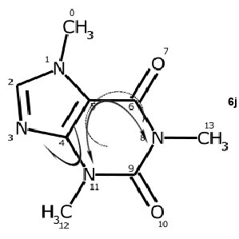

[](https://opensource.org/licenses/MIt)
[](https://github.com/OBrink/RanDepict/graphs/commit-activity)

[](https://GitHub.com/OBrink/RanDepict/issues/)
[](https://GitHub.com/OBrink/RanDepict/graphs/contributors/)
[](https://GitHub.com/OBrink/RanDepict/releases/)
[](https://pypi.python.org/pypi/RanDepict/)

[](https://doi.org/10.5281/zenodo.5531702)
[](https://randepict.readthedocs.io/en/latest/?badge=latest)


This repository contains RanDepict, an easy-to-use utility to generate a big variety of chemical structure depictions (random depiction styles and image augmentations) based on RDKit, CDK, Indigo and PIKAChU.

## Usage
-  To use RanDepict, clone the repository to your local disk and make sure you install all the necessary requirements.

##### We recommend to use RanDepict inside a Conda environment to facilitate the installation of the dependencies.
- Conda can be downloaded as part of the [Anaconda](https://www.anaconda.com/) or the [Miniconda](https://conda.io/en/latest/miniconda.html) plattforms (Python 3.7). We recommend to install miniconda3. Using Linux you can get it with:
```shell
$ wget https://repo.anaconda.com/miniconda/Miniconda3-latest-Linux-x86_64.sh
$ bash Miniconda3-latest-Linux-x86_64.sh
```
### Installation

```shell
$ git clone https://github.com/OBrink/RanDepict.git
$ cd RanDepict
$ conda create --name RanDepict python=3.7
$ conda activate RanDepict
$ conda install -c rdkit rdkit
$ conda install pip
$ python -m pip install -U pip #Upgrade pip
$ pip install .
```
### Alternative
```shell
$ python -m pip install -U pip #Upgrade pip
$ pip install git+https://github.com/OBrink/RanDepict.git
```

### Install from PyPI
```shell
$ pip install RanDepict
```

### Basic usage: 
```python
from RanDepict import RandomDepictor

smiles = "CN1C=NC2=C1C(=O)N(C(=O)N2C)C"

with RandomDepictor() as depictor:
    image = depictor(smiles)
``` 

Have a look in the RanDepictNotebook.ipynb for more examples and a more detailed [documentation check here](https://randepict.readthedocs.io/en/latest/).

Here are some examples of depictions of caffeine without augmentations (left) and with augmentations (right) that were automatically created using RanDepict. 

   


## Cite Us

- Brinkhaus, H.O., Rajan, K., Zielesny, A. et al. RanDepict: Random chemical structure depiction generator. J Cheminform 14, 31 (2022). https://doi.org/10.1186/s13321-022-00609-4

## More information about our research group

[](https://cheminf.uni-jena.de)

